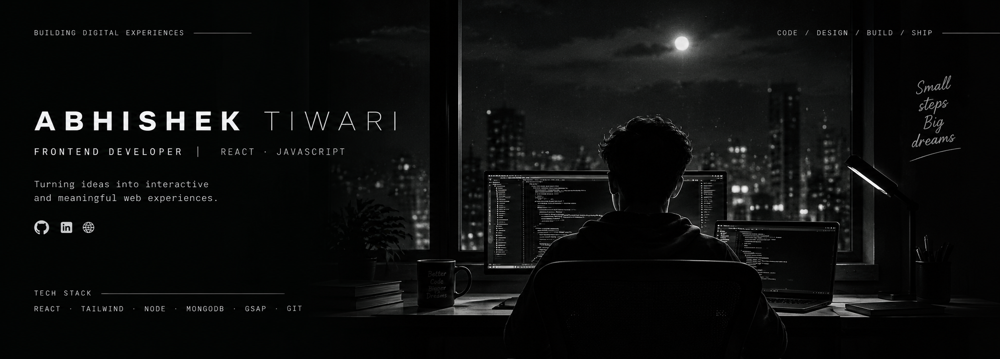

<div align="center">



<br><br>

# ABHISHEK TIWARI

### FRONTEND DEVELOPER

`React` · `JavaScript` · `UI/UX` · `Creative Development`

<br>

I design and build modern web experiences
where **clean UI meets meaningful functionality.**

<br>

[ **VIEW PROJECTS** ](https://github.com/Abhishek-69889?tab=repositories)
  ·  
[ **LINKEDIN** ](https://www.linkedin.com/in/abhishek-softweredeveloper/)
  ·  
[ **PORTFOLIO** ](https://vedxians.vercel.app)

</div>

<br>

---

<div align="center">

## `01` — ABOUT ME

</div>

<br>

```text
I'm Abhishek — a frontend developer who enjoys turning
ideas into clean, interactive and useful digital products.

Currently focused on React, modern frontend development,
DSA and building products from scratch.

I care about three things:

        DESIGN          EXPERIENCE          FUNCTIONALITY
           ↓                ↓                   ↓
        Clean UI       Smooth interaction    Real problems
```

<br>

---

<div align="center">

## `02` — SELECTED WORK

### Things I've built

</div>

<br>

<table>
<tr>

<td width="50%" valign="top">

### HIREPILOT

**Your job search, reimagined.**

A full-stack job-search copilot designed to reduce the repetitive work involved in finding jobs, matching skills and preparing applications.

<br>

**BUILDING WITH**

`React` `Node.js` `Express` `MongoDB`

<br>

**STATUS**

`● IN DEVELOPMENT`

</td>

<td width="50%" valign="top">

### DSA MASTERY

**Practice. Prepare. Perform.**

A focused DSA platform built for structured problem solving and interview preparation.

<br>

**BUILDING WITH**

`React` `Vite` `JavaScript` `Tailwind`

<br>

[ **LIVE PROJECT →** ](https://dsapractice.netlify.app/)

</td>

</tr>

<tr>

<td width="50%" valign="top">

### VEDX

**Learn. Practice. Get Placed.**

A learning and placement platform covering frontend development, DSA, roadmaps, quizzes and practical learning.

<br>

**BUILDING WITH**

`React` `Vite` `Tailwind` `GSAP`

<br>

[ **LIVE PROJECT →** ](https://vedxians.vercel.app/)

</td>

<td width="50%" valign="top">

### MORE COMING

**Always building something.**

I regularly experiment with new ideas, interfaces and developer tools.

<br>

**NEXT**

`Products` `Experiments` `Open Source`

<br>

[ **VIEW ALL →** ](https://github.com/Abhishek-69889?tab=repositories)

</td>

</tr>
</table>

<br>

---

<div align="center">

## `03` — WHAT I DO

</div>

<br>

<table>
<tr>

<td align="center" width="25%">

### 01

**FRONTEND**

React
JavaScript
Tailwind
Vite
GSAP

</td>

<td align="center" width="25%">

### 02

**BACKEND**

Node.js
Express
REST APIs
MongoDB
JWT

</td>

<td align="center" width="25%">

### 03

**PROBLEM SOLVING**

C++
DSA
SQL
OOP
Algorithms

</td>

<td align="center" width="25%">

### 04

**TOOLS**

Git
GitHub
Postman
VS Code
Figma

</td>

</tr>
</table>

<br>

---

<div align="center">

## `04` — EXPERIENCE

</div>

<br>

### FRONTEND DEVELOPER

**VedX Coding School** · 2026 — Present

Building responsive interfaces, improving performance and creating interactive learning experiences using React, JavaScript, Tailwind CSS and Vite.

<br>

### SOFTWARE DEVELOPER

**Hanumant Technology** · 2025

Worked on React applications, reusable components, authentication systems, MongoDB integration and production deployments.

<br>

### FULL-STACK WEB DEVELOPER INTERN

**HCL GUVI** · 2025

Built MERN applications, REST APIs and responsive interfaces while working with authentication, databases and production issues.

<br>

---

<div align="center">

## `05` — EDUCATION

### INDIAN INSTITUTE OF TECHNOLOGY PATNA

**B.Sc. (Hons.) Computer Science & Data Analytics**

`CPI — 8.68`

</div>

<br>

---

<div align="center">

## `06` — CURRENTLY BUILDING

<br>

```text
                         ┌─────────────────────┐
                         │      HIREPILOT      │
                         │                     │
                         │  BUILDING → SHIP    │
                         └─────────────────────┘

                    ↓

             ADVANCED REACT
                    +
          BACKEND ARCHITECTURE
                    +
                 DSA

                    ↓

              BETTER PRODUCTS
```

</div>

<br>

---

<div align="center">

## `07` — GITHUB

<br>


<br><br>


</div>

<br>

---

<div align="center">

## `08` — LET'S CONNECT

<br>

I'm currently looking for opportunities where I can
**build, learn and contribute to meaningful products.**

<br><br>

[ **LINKEDIN** ](https://www.linkedin.com/in/abhishek-softweredeveloper/)
   
[ **GITHUB** ](https://github.com/Abhishek-69889)
   
[ **PORTFOLIO** ](https://vedxians.vercel.app)

<br><br>

---

### BUILD. BREAK. LEARN. REPEAT.

<br>

`© 2026 ABHISHEK TIWARI`

</div>
